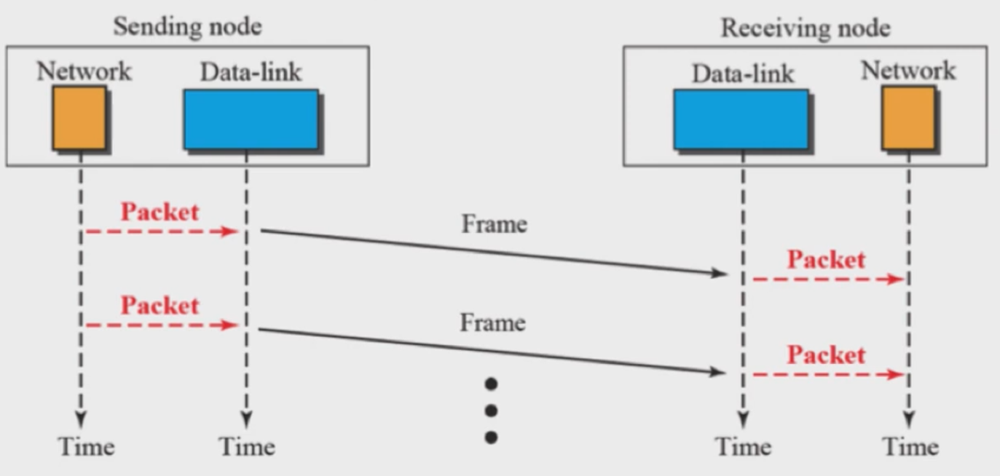

# 컴넷 09.15

## DLC Basic

Daka-link layer는 MAC layer 과 Data-link control(DLC) 로 구분된다. DLC는 Message를 보내기 위해 상위 층에서 내려온 Packet을 Frame으로 포장한다. 또한 Error 검출과 복구 Flow control을 수행한다.

- Framing
  Framing은 편지를 보내는 과정과 유사하다. 3계층에서 내려온 Data를 보낼 수 있는 크기로 나누고 송신단의 Source address 수신단의 Destination address를 담는다. 그리고 Error 검출과 복구를 수행할 수 있는 정보를 담는다.

  - A frame in a character-oriented protocol

    

    Message를 보내는 것은 0과 1 이 전송되는 것이다. 이때 Charater 타입으로 하는 것이 Character-oriented protocol 이라 한다.

    1. Flag

       Physical layer끼리는 Message를 보내지 않더라도 끊임없이 Training 하고 있다. 이는 0과 1을 구별하기 위해서다. 선두의 Flag는 Training을 그만하고 이제 Message가 온다는 의미이다. 후미의 Flag는 Message가 전부 전송되었음을 의미한다.

    2. Header & Trailer

       3계층에서 보내고 싶은 Data가 내려오면 필요할 경우 Header와 Trailer를 붙인다.

  - Byte stuffing and unstuffing

    

    Byte stuffing은 Byte 단위를 썼다는 것이다. 따라서 Character data type 으로 처리했다는 것이다.

    1. Stuffing

       ESC(escape sequence) 라는 특수 코드를 Data 사이에 삽입하는 과정이다. ESC 3계층에서 내려온 Data에 Flag와 동일한 Code가 있을 경우 구별해준다. ESC + Flag 로 만들어주고 ESC Code 와 동일한 Data도 있을 수 있으므로 이땐 ESC + ESC 로 만들어진다.

    2. Unstuffing

       ESC를 빼는 과정이다.

  - Bit stuffing and unstuffing

    

    프로그래밍을 할때 Data를 Bit 단위로 처리했다는 것이다.

    1. Stuffing

       Bit stuffing 에서 특별한 점은 1이 5번 연속되면 그 다음 0 을 집어넣는다.

    2. Unstuffing

       Flag를 구별하는 Code를 제거한다. 1 x 5 다음 0을 제거한다.

    - Bit 단위를 사용한 이유

      과거엔 느린 통신조자 가격이 비쌌다. 비산 통신 Link 를 최대한 효율적으로 사용하고자 Bit 단위를 사용했다.

- Flow and Error Control

  

  2 계층 이상인 구조에선 Sending node 와 Receiving node 사이 Data 만 주고받는 것이 아니고 끊임없이 Feedback 을 주고 받는다. 이것으로 Flow control을 한다.

  - Connection

    오른쪽과 왼쪽의 장치가 연결될 때 2계층 이상의 연결은 Connection이라 한다. 실재로 연결되는 건 아니고 Logical 한 Software로 연결된다. Conntection 사용 여부로 2가지 방식이 있다.

    - Connection less

      Connection을 사용하지 않고 통신 하는 것이다. 이때 통신은 일방적으로 Message 를 보낸다.

    - Connection oriented

      Connection을 사용하기 때문에 Connection 연결, 유지, 해제 과정이 담겨 있다. 대부분 Flow Control 과 Error Control을 수행하는 것은 Connection oriented 방식이다.

## Simple Protocol

Simple 방식은 자연계에선 존재할 수 없다.

- Simple Protocol

  

  Flow Control 과 Error Control 하지 않는다. 이 과정에서 어떠한 속도 차이도 없고 Error도 발생하지 않는다. 그래서 자연계에서 존재할 수 없다.

- FSM for the simple Protocol

  

  Finite state machine '상태천이도'라고 한다. 해당 사진은 처음 전원을 켰을 때 Sending node 는 Ready State가 된다. 이후 Packet came from network layer 라는 Event가 발생하면 Make a frame and send it 이라는 Action을 수행한다는 뜻이다.

- Operation of the simple protocol

  - Ladder diagram & MSC

    아래 사진 처럼 아래 방향 화살표로 표현한 것을 Ladder diagram 이라 한다. 통상 시간 흐름에 따라 동작을 나타내기 위해 표현하는데 이처럼 시간의 흐름을 강조 한것을 Message sequence chart (MSC)라고 한다.

  

  Sending node의 Network 에서 Data-link layer로의 Packet을 전송할 땐 시간차이가 거의 없으므로 일직선으로 나타난다. Packet을 전송하고 Data-link 에서 Frame 으로 만든다음 Receiving node 로 전송하면 시간 흐름에 따라 화살표가 사선으로 그어진다.

  - System 설계도 & Block 설계도

    Sending node 와 Receiving node 만 나타낸 설계도를 System 설계도라 한다. 이때 Block 을 사용하여 상세하게 그려둔 것이 Block 설계도다. 위의 사진은 Block 설계도에 해당한다.

## Stop and wait Protocol

Simple protocol와 달리 어떠한 이유에서 Error 는 생긴다. Error 를 검출하고 복구하는 첫번째 시도가 Stop-and-Wait Protocol 이다.

- Error 의 종류

  통신에서 Error 는 크게 2가지이다.

  1. 메시지를 받았지만 변질된 경우
  2. 메시지가 사라진 경우

- Stop and Wait Protocol

  

  Stop and Wait 방식은 Message를 하나 보내고 수신단에서 정상적으로 받았을 때 알리는 ACK Message가 도착할 때 까지 재전송한다.

  - ACK Message 생성 과정

    Data-link 에서 Frame을 만들때 CRC Code 붙여주는 방식을 이용한다. Receiving node 에서 Message가 도착했다면 해당 Frame을 바탕으로 CRC Code 를 자체 생성한다. 이때 두 CRC Code 값이 같으면 ACK Message를 보낸다. 이렇게 Message를 하나 보내고 기다리니 자연스럽게 Flow control이 된다.

  - Error control 방법

    1. 메시지를 받았지만 변질된 경우

       Receiving node에서 생성한 CRC code 값이 Frame의 CRC code 값과 다르면 변질된 것이다. 이때 Receiving node의 Data-link에서는 해당 Message를 버리고 ACK Message를 보내지 않는다. Sending node의 Timer로 ACK Message 가 정해둔 시간 안에 도착하지 안으면 재전송 한다.

    2. 메시지가 사라진 경우

       Sending node의 Timer를 사용한다. Timer를 사용해서 정해둔 시간 안으로 ACK Message 도착 유무를 따진다. ACK Message가 도착하지 않아 Timer가 터졌다면 정해둔 횟수만큼 재전송 한다.

  - FSM for the stop-and-wait protocol

    

    - Sending node

      전원을 키면 Sending node는 Ready 상태가 되어 상층에서 Packet 이 도착하길 기다린다. Packet이 도착하면 Frame을 만들고 재전송을 대비해서 Copy 한다. 그리고 Timer 를 동작시킨다. 이후 Blocking 상태가 되어 Error 문제가 없을 때 까지 Action 했다가 성공적으로 ACK Message가 도착했다면 다시 Ready 상태로 간다.

    - Receiving node

      Ready 상태에서 Error 가 발생하면 Frame을 버리는 Action을 한다. Error 가 없는 Frame을 받았다면 Frame 포장을 벗기고 Packet을 Network layer로 보낸다. 그리고 ACK Message를 쏜다.

  - Stop and Wait Flow diagram

    

    - 문제 상황

      Sending node에서 ACK Messag가 유실된다면 Receiving node 에서 재전송한다. Network layer 에는 동일한 Data가 중복해서 올라간다.

    - 해결 방법

      Frame에 번호를 추가한다. 0과 1을 Frame 에 붙여서 ACK Message를 받았을 경우에만 Frame 번호를 바꾼다.

- Piggybacking

  ACK Message 처럼 별도의 Message를 보내는게 아니고 전송할 Data가 있다면 그 속에 ACK Message를 실어서 같이 보내는거다. 이는 통신에서 Message 길이보다 주고받는 횟수를 줄이는 것이 중요하기 때문이다.

## Go - Back - N Protocol

짧은 시간에 더 많은 Data를 보내기 위한 방법이다. Stop-and-wait 처럼 하나 보내고 기다리지 않는다는 것이다.

- Send window for go-back-N ARQ

  

  ACK Message가 도착하기 전에 여러개의 Message를 보낸다. 이때 Window size 만큼 전송할 수 있다.

  - Window

    Circular ring 형태로 구현된다. Window 안의 Buffer를 사용해 보낼 수 있는 Message 한계를 관리한다. Window size = 2^m -1 이다.

  - Window size = 2^m 이 아닌 이유

    

    Sending node Window size가 꽉 찼다면 Receiver 의 ACK 가 전부 손실났다는 것이다. 이때 Window size 가 2^m 이라면 Sender 가 재전송하 Message 임을 Receiver 는 알아차리지 못한다. 따라서 Data가 중복되는 문제가 발생한다.

- Flow diagram for GO-Back-N ARQ

  1. Example 1

     

     Sending node 에서 연달아 Message를 보냈을 경우 먼저 보낸 Message의 ACK Message가 유실 되더라도 뒤에 ACK Message 가 도착했다면 Message가 정상적으로 도착했음을 알고 Slide 시킨다.

  2. Example 2

     
     Sender 에서 보낸 Message의 ACK Message가 도착하지 않았다면 Sending node의 Timer 가 터지기 때문에 Sf Buffer 부터 Message를 차례대로 재전송한다.

## Selective Repeative Protocol

Stop-and-Wait Protocol 방식에선 Message를 여러개 보냈을 경우 앞선 Message의 ACK 가 오지 못했다면 뒤에 보낸 Message가 정상적으로 도착 했더라도 전부 재전송한다. 이것을 개선한 방법이 Selective Repeat Protocol 이다.

- Receiver window for Selective Repeat ARQ

  

  Sender의 Window Buffer는 Receiver에서 ACK Message를 보낸 것만 선별적으로 지울 수 있다.

  
  이를 위해 Receiver window size가 Sender의 Window size와 동일해졌다. Buffer를 통해서 Message가 정상적으로 도착한 것과 Error가 난 것을 구분한다.

  - Window

    Window size = 2^(m-1) 로 Buffer 전체 사이즈의 절반만 사용한다.

  - Design of Selective Repeat ARQ

    Message를 잘 받으면 ACK Message Message를 받지 못하면 NAK Message를 보낸다.

## DLC Example - HDLC

HDLC(High-level Data Link Control). 2계층 위에 Application level 이 바로 올라간 경우이다. 즉 사용가능한 장치이다. 예시로 FAX 처럼 전화선으로 정보를 주고받는 것이다.

- HDLC Frames

  1. I-frame

  User info 를 주고받을 때 사용한다.

  2. S-frame

     ACK Message같이 User info 가 없어도 될 때 사용한다.

  3. U-frame

     관리자 입장에서 필요한 정보를 넣어 보낼 때 사용한다.

- Example of connection and disconnection

  

  전화선으로 카드 결제같은 일을 진행하면 Connection oriented 방식을 사용한다. 이때 U-frame (SABM)을 통해 연결 요청을 하고 ACK Message 격으로 U-frame (UA)를 받는다. 정보를 주고받고 나면 U-frame (DISC)을 통해 연결 해제를 요청하고 U-frame (UA)를 받는다.

## DLC Example - PPP

PPP는 3계층 이상의 Application 에서 이 사용자가 합법적인지, 얼마만큼의 지원을 받으면 되는지, 암호화를 관리한다. 또한 상위 계층의 IP protocol 이 원할하게 동작하게 해준다. Error 검출 및 복구의 기능은 하지 않는다.

- Tramsition phase

  

  전원이 들어오면 Dead 상태에서 시작한다. Physical layer (carrirer)가 정상적으로 연결 되었으면 Authenticate 상태로 진입한다. 이동통신이라면 USIM 을 통해 합법적인 사용자인지 판단하고 정상이라면 Network 상태에 진입해서 1,2층과 Network-layer config 를 잡아준다. 이후 Open 상태가 되어 Data tranfer 상태가 된다.

- PAP packets encapsulated in a PPP frame

  PPP의 중요한 역할은 Authentification 이다. 사용자의 합법성을 따지고 합법적이면 ACK 불법이면 NAK 을 날린다.

- CHAP packets encapsulated in a PPP frame

  Server 에서 지금 Authentification 을 하라도 Challenge를 준다. 이때만 User가 Message를 보낼 수 있다.
